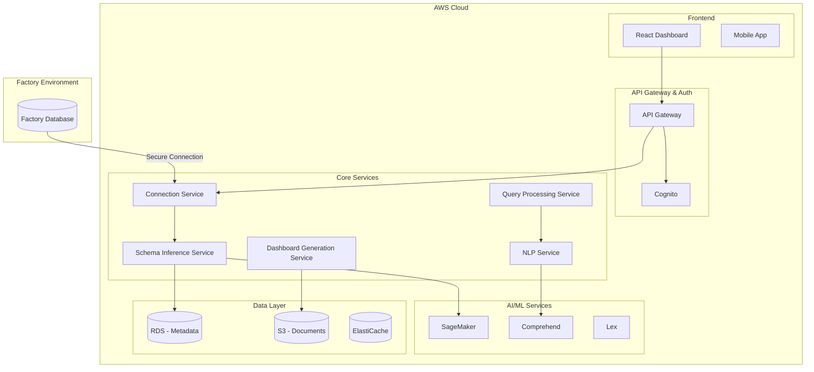

# Design Document

## Overview

The Factory Analytics and Dashboard Platform is a cloud-native, AI-powered analytics solution built on AWS that automatically discovers and analyzes factory database schemas to provide intelligent insights and dashboards. The system uses a microservices architecture with event-driven processing to handle schema inference, natural language query processing, and real-time dashboard generation while maintaining strict data privacy and security standards.

## Architecture

### High-Level Architecture



### Deployment Architecture

The system will be deployed using AWS ECS Fargate with Application Load Balancer for high availability and auto-scaling. Each microservice runs in its own container with independent scaling policies.

## Components and Interfaces

### 1. Connection Service

**Purpose:** Manages secure database connections and credential handling

**Key Responsibilities:**
- Establish encrypted connections to factory databases
- Manage connection pooling and health monitoring
- Handle various database types (PostgreSQL, MySQL, SQL Server, Oracle)
- Implement connection retry logic and failover

**Interfaces:**
- REST API for connection management
- WebSocket for real-time connection status
- Integration with AWS Secrets Manager for credential storage

### 2. Schema Inference Service

**Purpose:** Analyzes database structure and infers relationships using AI

**Key Responsibilities:**
- Scan database tables, columns, and data types
- Analyze data patterns and relationships using ML algorithms
- Parse uploaded schema documents (PDF, Word, images)
- Generate confidence scores for inferred relationships
- Normalize inconsistent naming conventions

**AI/ML Components:**
- Custom SageMaker model for relationship inference
- Amazon Textract for document parsing
- Pattern recognition algorithms for naming normalization

**Interfaces:**
- Event-driven processing via SQS
- REST API for schema queries
- Integration with Amazon Comprehend for text analysis

### 3. Natural Language Processing Service

**Purpose:** Converts natural language queries to SQL

**Key Responsibilities:**
- Parse user intent from natural language
- Map business terms to database entities
- Generate optimized SQL queries
- Validate query safety and permissions

**AI/ML Components:**
- Fine-tuned language model for SQL generation
- Amazon Lex for intent recognition
- Custom NLP pipeline for domain-specific terminology

**Interfaces:**
- REST API for query processing
- WebSocket for real-time query suggestions
- Integration with Query Processing Service

### 4. Query Processing Service

**Purpose:** Executes queries and manages result processing

**Key Responsibilities:**
- Execute SQL queries against factory databases
- Implement query optimization and caching
- Handle result pagination and streaming
- Apply data privacy filters and masking

**Interfaces:**
- REST API for query execution
- Integration with ElastiCache for result caching
- Event publishing for audit logging

### 5. Dashboard Generation Service

**Purpose:** Creates visualizations and dashboards from data

**Key Responsibilities:**
- Generate appropriate chart types based on data characteristics
- Create default KPI dashboards
- Handle real-time data updates
- Export dashboards in various formats

**Interfaces:**
- REST API for dashboard operations
- WebSocket for real-time updates
- Integration with S3 for dashboard templates

### 6. Recommendation Engine

**Purpose:** Provides actionable insights and recommendations

**Key Responsibilities:**
- Analyze data patterns for anomaly detection
- Generate maintenance recommendations
- Identify efficiency improvement opportunities
- Provide confidence scores and explanations

**AI/ML Components:**
- Time series analysis models
- Anomaly detection algorithms
- Predictive maintenance models

## Data Models

### Schema Metadata Model

```typescript
interface SchemaMetadata {
  id: string;
  connectionId: string;
  tables: Table[];
  relationships: Relationship[];
  inferenceConfidence: number;
  lastUpdated: Date;
  version: string;
}

interface Table {
  name: string;
  normalizedName: string;
  columns: Column[];
  estimatedRowCount: number;
  businessContext?: string;
}

interface Column {
  name: string;
  normalizedName: string;
  dataType: string;
  nullable: boolean;
  isPrimaryKey: boolean;
  isForeignKey: boolean;
  businessMeaning?: string;
  confidenceScore: number;
}

interface Relationship {
  fromTable: string;
  fromColumn: string;
  toTable: string;
  toColumn: string;
  relationshipType: 'ONE_TO_ONE' | 'ONE_TO_MANY' | 'MANY_TO_MANY';
  confidenceScore: number;
  inferenceMethod: string;
}
```

### Dashboard Configuration Model

```typescript
interface Dashboard {
  id: string;
  name: string;
  userId: string;
  widgets: Widget[];
  layout: Layout;
  refreshInterval: number;
  isDefault: boolean;
  createdAt: Date;
  updatedAt: Date;
}

interface Widget {
  id: string;
  type: 'CHART' | 'KPI' | 'TABLE' | 'GAUGE';
  title: string;
  query: string;
  visualization: VisualizationConfig;
  position: Position;
  size: Size;
}
```

### Query Model

```typescript
interface Query {
  id: string;
  naturalLanguageQuery: string;
  generatedSQL: string;
  userId: string;
  connectionId: string;
  executionTime: number;
  resultCount: number;
  confidenceScore: number;
  createdAt: Date;
}
```

## Error Handling

### Connection Errors
- Implement exponential backoff for connection retries
- Provide clear error messages for authentication failures
- Handle network timeouts gracefully
- Log all connection attempts for debugging

### Query Errors
- Validate SQL queries before execution
- Handle database-specific error codes
- Provide user-friendly error explanations
- Implement query timeout mechanisms

### AI/ML Errors
- Handle model inference failures gracefully
- Provide fallback mechanisms for NLP processing
- Log confidence scores for debugging
- Implement model versioning for rollbacks

### System Errors
- Implement circuit breaker patterns for external services
- Use dead letter queues for failed message processing
- Provide health check endpoints for all services
- Implement comprehensive logging and monitoring

## Testing Strategy

### Unit Testing
- Test each microservice independently
- Mock external dependencies (databases, AWS services)
- Achieve 90%+ code coverage
- Use property-based testing for data validation

### Integration Testing
- Test service-to-service communication
- Validate database connection handling
- Test AI/ML model integration
- Verify AWS service integrations

### End-to-End Testing
- Test complete user workflows
- Validate dashboard generation
- Test natural language query processing
- Verify data privacy compliance

### Performance Testing
- Load testing for concurrent users
- Database query performance testing
- AI model inference latency testing
- Auto-scaling behavior validation

### Security Testing
- Penetration testing for API endpoints
- Database connection security validation
- Data encryption verification
- Access control testing

### AI/ML Testing
- Model accuracy validation
- Schema inference quality testing
- NLP query translation accuracy
- Recommendation engine effectiveness

## Security and Privacy

### Data Protection
- All data in transit encrypted using TLS 1.3
- Database credentials stored in AWS Secrets Manager
- Query results cached with encryption at rest
- Automatic data retention policies

### Access Control
- Role-based access control (RBAC)
- Multi-factor authentication via Cognito
- API rate limiting and throttling
- Audit logging for all data access

### Compliance
- GDPR compliance for data processing
- SOC 2 Type II compliance
- Regular security assessments
- Data anonymization capabilities

## Monitoring and Observability

### Metrics
- Application performance metrics via CloudWatch
- Database connection health monitoring
- AI model performance tracking
- User engagement analytics

### Logging
- Structured logging with correlation IDs
- Centralized log aggregation
- Security event logging
- Performance bottleneck identification

### Alerting
- Real-time alerts for system failures
- Performance degradation notifications
- Security incident alerts
- Capacity planning alerts