# Design Document

## Overview

The Factory Analytics and Dashboard Platform is a cloud-native, AI-powered analytics solution designed to securely connect with any factory data source—including ERP, MES, IoT, data warehouses, or other databases. The platform automatically infers database structures and relationships using AI, machine learning, and automated metadata analysis, even when schemas are incomplete, missing, or inconsistently named. Built on AWS with hybrid deployment support, the system provides dynamic, customizable dashboards, natural language querying, actionable AI-driven recommendations, multi-tenant security, and full privacy compliance. The architecture emphasizes extensibility, vendor-neutrality, and enterprise scalability across diverse manufacturing environments.

## Architecture

### High-Level Architecture

```mermaid
graph TB
    subgraph "Factory Environment"
        FDB[(Factory Database)]
        ERP[(ERP System)]
        MES[(MES System)]
        IOT[(IoT Devices)]
        DW[(Data Warehouse)]
    end
    
    subgraph "AWS Cloud / Hybrid"
        subgraph "API Gateway & Auth"
            AG[API Gateway]
            COG[Cognito Multi-Tenant]
        end
        
        subgraph "Core Services"
            CS[Connection Service]
            SIS[Schema Inference Service]
            QPS[Query Processing Service]
            DGS[Dashboard Generation Service]
            NLP[NLP Service]
            REC[Recommendation Engine]
            ALERT[Alert Service]
            TENANT[Tenant Management]
            I18N[Internationalization Service]
        end
        
        subgraph "AI/ML Services"
            SM[SageMaker]
            COMP[Comprehend]
            LEX[Lex]
            BEDROCK[Amazon Bedrock]
        end
        
        subgraph "Data Layer"
            RDS[(RDS - Metadata)]
            S3[(S3 - Documents/Templates)]
            REDIS[(ElastiCache)]
            AUDIT[(Audit Logs)]
        end
        
        subgraph "Integration Layer"
            PLUGIN[Plugin Registry]
            WEBHOOK[Webhook Service]
            API[External APIs]
        end
        
        subgraph "Frontend"
            WEB[React Dashboard]
            MOB[Mobile App]
            EMBED[Embeddable Widgets]
        end
    end
    
    FDB -->|Secure Connection| CS
    ERP -->|Secure Connection| CS
    MES -->|Secure Connection| CS
    IOT -->|Secure Connection| CS
    DW -->|Secure Connection| CS
    CS --> SIS
    SIS --> SM
    SIS --> RDS
    QPS --> NLP
    NLP --> COMP
    NLP --> BEDROCK
    DGS --> S3
    REC --> ALERT
    WEB --> AG
    AG --> COG
    AG --> TENANT
    PLUGIN --> CS
    API --> WEBHOOK
```



### Deployment Architecture

The system supports both cloud-native AWS deployment and hybrid environments. AWS deployment uses ECS Fargate with Application Load Balancer for high availability and auto-scaling. Each microservice runs in its own container with independent scaling policies. For hybrid deployments, core services can run on-premises while leveraging AWS AI/ML services through secure API connections. Multi-tenant isolation is achieved through separate database schemas and resource tagging, with tenant-specific scaling policies.

## Components and Interfaces

### 1. Connection Service

**Purpose:** Manages secure connections to diverse factory data sources with pluggable connector architecture

**Key Responsibilities:**
- Establish encrypted connections to factory databases, ERP, MES, IoT, and data warehouses
- Support pluggable connectors for extensibility to new data source types
- Manage connection pooling, health monitoring, and failover
- Handle various protocols (JDBC, REST, MQTT, OPC-UA, etc.)
- Implement connection retry logic with exponential backoff
- Provide clear error messages and troubleshooting guidance

**Pluggable Connector Architecture:**
- Base connector interface for standardized integration
- Pre-built connectors for common systems (SAP, Oracle, Siemens, etc.)
- Custom connector development framework
- Connector marketplace and registry

**Interfaces:**
- REST API for connection management
- WebSocket for real-time connection status
- Integration with AWS Secrets Manager for credential storage
- Plugin API for custom connectors

### 2. Schema Inference Service

**Purpose:** Automatically analyzes and maintains database structures using AI, even with incomplete or inconsistent schemas

**Key Responsibilities:**
- Scan all accessible data sources analyzing metadata, names, types, and samples
- Infer relationships using AI/ML with confidence scoring
- Parse external schema documents (Word, PDF, images, text) using OCR and NLP
- Normalize inconsistent field and table names to standardized business terminology
- Detect schema evolution and alert users to changes
- Generate comprehensive, explainable metadata models
- Provide APIs/webhooks for third-party validation

**AI/ML Components:**
- Custom SageMaker models for relationship inference and pattern recognition
- Amazon Textract for document parsing and OCR
- Amazon Bedrock for advanced language understanding
- ML algorithms for naming normalization and business term mapping
- Confidence scoring algorithms for relationship validation

**Schema Evolution Handling:**
- Automated change detection and impact analysis
- Version control for schema metadata
- Migration assistance for schema changes
- User notification system for breaking changes

**Interfaces:**
- Event-driven processing via SQS
- REST API for schema queries and management
- Webhook API for external validation systems
- Integration with document processing services

### 3. Natural Language Processing Service

**Purpose:** Converts natural language queries to SQL with multi-language support and narrative explanations

**Key Responsibilities:**
- Parse user intent from natural language in multiple languages
- Map business terms to database entities using current schema model
- Generate accurate, explainable SQL queries with safety validation
- Create narrative explanations of insights, trends, and implications
- Support multi-language interfaces and localization
- Provide query suggestions and auto-completion

**AI/ML Components:**
- Fine-tuned language models for SQL generation (Amazon Bedrock)
- Amazon Lex for multi-language intent recognition
- Custom NLP pipeline for manufacturing domain terminology
- Translation services for multi-language support
- Narrative generation models for business-friendly explanations

**Multi-Language Support:**
- Support for major manufacturing languages (English, German, Chinese, Japanese, Spanish)
- Localized business terminology dictionaries
- Cultural context awareness for manufacturing terms
- Real-time translation capabilities

**Interfaces:**
- REST API for query processing with language parameters
- WebSocket for real-time query suggestions
- Integration with Query Processing Service
- Localization API for term management

### 4. Query Processing Service

**Purpose:** Executes queries with privacy controls, working only on authorized extracts

**Key Responsibilities:**
- Execute SQL queries against factory databases with permission validation
- Work exclusively with query results - never store raw factory data permanently
- Implement query optimization, caching, and result streaming
- Apply data masking, anonymization, and privacy controls
- Respect user permissions and tenant isolation
- Generate comprehensive audit trails for all data access
- Handle result pagination and export formatting

**Privacy and Security Features:**
- Query-level data access only (no raw data export/storage)
- Granular privacy controls and data masking
- Tenant-specific data isolation
- Role-based query permissions
- Automatic data retention policies
- GDPR-compliant data processing

**Interfaces:**
- REST API for query execution with privacy controls
- Integration with ElastiCache for secure result caching
- Event publishing for comprehensive audit logging
- Integration with tenant management for access control

### 5. Dashboard Generation Service

**Purpose:** Creates intelligent visualizations and customizable dashboards with automatic KPI generation

**Key Responsibilities:**
- Generate default dashboards for production volume, efficiency, downtime, quality metrics
- Automatically select appropriate visualizations (charts, gauges, tables) based on data type
- Handle missing/partial metrics with alternative measurement suggestions
- Support real-time and near-real-time data updating
- Enable drag-and-drop dashboard customization and layout management
- Export dashboards in multiple formats (HTML, PDF, Excel, JSON, images)
- Provide dashboard sharing with permission controls

**Default Dashboard Templates:**
- Production KPI dashboard (volume, efficiency, OEE)
- Quality metrics dashboard (defect rates, yield, compliance)
- Maintenance dashboard (downtime, MTBF, scheduled maintenance)
- Energy and resource utilization dashboard
- Custom industry-specific templates

**Customization Features:**
- Widget library with extensible visualization types
- Custom dashboard templates and themes
- Layout management with responsive design
- Collaborative dashboard sharing and commenting

**Interfaces:**
- REST API for dashboard operations and customization
- WebSocket for real-time updates
- Integration with S3 for templates and exports
- Embedding API for external applications

### 6. Recommendation Engine

**Purpose:** Provides proactive, actionable recommendations with integrated alerting and automation

**Key Responsibilities:**
- Detect patterns indicating equipment failures, efficiency declines, quality anomalies
- Generate prioritized recommendations with confidence levels and suggested actions
- Provide supporting data, analysis methodology, and clear explanations for auditability
- Integrate with factory notification, ticketing, and maintenance scheduling systems
- Support end-to-end automation workflows
- Monitor recommendation effectiveness and model performance

**AI/ML Components:**
- Time series analysis models for trend detection
- Anomaly detection algorithms for real-time monitoring
- Predictive maintenance models using equipment sensor data
- Pattern recognition for quality control
- Optimization algorithms for efficiency improvements

**Integration Capabilities:**
- CMMS (Computerized Maintenance Management System) integration
- Work order generation and tracking
- Email, SMS, and push notification delivery
- Integration with factory automation systems
- Webhook support for custom integrations

**Interfaces:**
- REST API for recommendation management
- Webhook API for external system integration
- Event-driven processing for real-time alerts
- Integration with notification services

### 7. Tenant Management Service

**Purpose:** Provides multi-tenant architecture with robust isolation and role-based access control

**Key Responsibilities:**
- Manage tenant onboarding and configuration
- Enforce tenant data isolation and resource boundaries
- Implement role-based access control (RBAC) across all services
- Handle tenant-specific customizations and branding
- Monitor tenant resource usage and billing
- Provide tenant administration interfaces

**Multi-Tenancy Features:**
- Complete data isolation between tenants
- Tenant-specific scaling policies and resource limits
- Custom branding and white-labeling capabilities
- Tenant-specific configuration management
- Cross-tenant analytics and benchmarking (with permission)

**Interfaces:**
- REST API for tenant management
- Integration with all core services for access control
- Billing and usage reporting APIs
- Admin dashboard for tenant management

### 8. Internationalization Service

**Purpose:** Provides comprehensive localization and multi-language support

**Key Responsibilities:**
- Manage translations for UI, reports, and system messages
- Handle locale-specific formatting (dates, numbers, currencies)
- Support right-to-left languages and cultural adaptations
- Manage manufacturing terminology dictionaries by region
- Provide translation management workflows

**Localization Features:**
- Support for 20+ languages including major manufacturing regions
- Industry-specific terminology management
- Cultural adaptation for manufacturing practices
- Time zone and regional compliance handling
- Collaborative translation workflows

**Interfaces:**
- REST API for translation management
- Integration with all user-facing services
- Translation workflow APIs for content management
- Locale detection and preference management

### 9. Plugin Registry and Extension Service

**Purpose:** Enables extensibility through modular plugins and integrations

**Key Responsibilities:**
- Manage plugin lifecycle (installation, updates, removal)
- Provide plugin development framework and SDK
- Handle plugin security validation and sandboxing
- Support custom analytics, visualizations, and data connectors
- Maintain plugin marketplace and documentation

**Extension Capabilities:**
- Custom data source connectors
- New visualization types and dashboard widgets
- Custom analytics algorithms and models
- Integration with third-party systems
- White-label and OEM customizations

**Interfaces:**
- Plugin management API
- SDK for plugin development
- Marketplace API for plugin distribution
- Security validation and approval workflows

## Data Models

### Schema Metadata Model

```typescript
interface SchemaMetadata {
  id: string;
  tenantId: string;
  connectionId: string;
  tables: Table[];
  relationships: Relationship[];
  inferenceConfidence: number;
  lastUpdated: Date;
  version: string;
  changeHistory: SchemaChange[];
  externalDocuments: ExternalDocument[];
}

interface Table {
  name: string;
  normalizedName: string;
  columns: Column[];
  estimatedRowCount: number;
  businessContext?: string;
  tags: string[];
  lastAnalyzed: Date;
}

interface Column {
  name: string;
  normalizedName: string;
  dataType: string;
  nullable: boolean;
  isPrimaryKey: boolean;
  isForeignKey: boolean;
  businessMeaning?: string;
  confidenceScore: number;
  privacyLevel: 'PUBLIC' | 'INTERNAL' | 'CONFIDENTIAL' | 'RESTRICTED';
  maskingRules?: MaskingRule[];
}

interface Relationship {
  fromTable: string;
  fromColumn: string;
  toTable: string;
  toColumn: string;
  relationshipType: 'ONE_TO_ONE' | 'ONE_TO_MANY' | 'MANY_TO_MANY';
  confidenceScore: number;
  inferenceMethod: string;
  validatedBy?: string;
  validatedAt?: Date;
}

interface SchemaChange {
  changeType: 'ADDED' | 'REMOVED' | 'MODIFIED';
  entityType: 'TABLE' | 'COLUMN' | 'RELATIONSHIP';
  entityName: string;
  changeDetails: any;
  detectedAt: Date;
  impactAssessment: string;
}

interface ExternalDocument {
  id: string;
  filename: string;
  documentType: 'PDF' | 'WORD' | 'IMAGE' | 'TEXT';
  extractedContent: string;
  relevantTables: string[];
  uploadedAt: Date;
  processedAt: Date;
}
```

### Dashboard Configuration Model

```typescript
interface Dashboard {
  id: string;
  name: string;
  tenantId: string;
  userId: string;
  widgets: Widget[];
  layout: Layout;
  refreshInterval: number;
  isDefault: boolean;
  isTemplate: boolean;
  shareSettings: ShareSettings;
  localization: LocalizationSettings;
  createdAt: Date;
  updatedAt: Date;
  tags: string[];
}

interface Widget {
  id: string;
  type: 'CHART' | 'KPI' | 'TABLE' | 'GAUGE' | 'CUSTOM';
  title: string;
  query: string;
  visualization: VisualizationConfig;
  position: Position;
  size: Size;
  permissions: WidgetPermissions;
  pluginId?: string; // For custom widget types
}

interface ShareSettings {
  isPublic: boolean;
  allowedUsers: string[];
  allowedRoles: string[];
  externalSharing: boolean;
  embedAllowed: boolean;
}

interface LocalizationSettings {
  locale: string;
  timezone: string;
  dateFormat: string;
  numberFormat: string;
  currency: string;
}
```

### Query Model

```typescript
interface Query {
  id: string;
  tenantId: string;
  naturalLanguageQuery: string;
  language: string;
  generatedSQL: string;
  userId: string;
  connectionId: string;
  executionTime: number;
  resultCount: number;
  confidenceScore: number;
  narrative: string;
  privacyLevel: 'PUBLIC' | 'INTERNAL' | 'CONFIDENTIAL' | 'RESTRICTED';
  auditTrail: AuditEntry[];
  createdAt: Date;
}

interface AuditEntry {
  action: string;
  userId: string;
  timestamp: Date;
  details: any;
  ipAddress: string;
  userAgent: string;
}

### Tenant Model

```typescript
interface Tenant {
  id: string;
  name: string;
  domain: string;
  subscriptionTier: 'BASIC' | 'PROFESSIONAL' | 'ENTERPRISE';
  settings: TenantSettings;
  branding: BrandingConfig;
  resourceLimits: ResourceLimits;
  createdAt: Date;
  isActive: boolean;
}

interface TenantSettings {
  defaultLocale: string;
  allowedLocales: string[];
  dataRetentionDays: number;
  privacySettings: PrivacySettings;
  integrationSettings: IntegrationSettings;
}

interface ResourceLimits {
  maxUsers: number;
  maxConnections: number;
  maxQueriesPerHour: number;
  maxStorageGB: number;
  maxConcurrentSessions: number;
}

### Plugin Model

```typescript
interface Plugin {
  id: string;
  name: string;
  version: string;
  type: 'CONNECTOR' | 'VISUALIZATION' | 'ANALYTICS' | 'INTEGRATION';
  author: string;
  description: string;
  configuration: PluginConfiguration;
  permissions: PluginPermissions;
  isActive: boolean;
  installedAt: Date;
  lastUpdated: Date;
}

interface PluginConfiguration {
  requiredSettings: ConfigurationField[];
  optionalSettings: ConfigurationField[];
  dependencies: string[];
  apiEndpoints: ApiEndpoint[];
}

### Recommendation Model

```typescript
interface Recommendation {
  id: string;
  tenantId: string;
  type: 'MAINTENANCE' | 'EFFICIENCY' | 'QUALITY' | 'SAFETY';
  priority: 'LOW' | 'MEDIUM' | 'HIGH' | 'CRITICAL';
  title: string;
  description: string;
  suggestedActions: Action[];
  supportingData: any;
  confidenceScore: number;
  methodology: string;
  createdAt: Date;
  status: 'ACTIVE' | 'ACKNOWLEDGED' | 'RESOLVED' | 'DISMISSED';
  assignedTo?: string;
  dueDate?: Date;
}
```

## Error Handling

### Connection Errors
- Implement exponential backoff for connection retries with jitter
- Provide clear, actionable error messages for authentication failures
- Handle network timeouts and connection drops gracefully
- Support multiple connection protocols and fallback mechanisms
- Log all connection attempts with tenant isolation for debugging
- Provide troubleshooting guidance for common connection issues

### Query Errors
- Validate SQL queries for safety and permissions before execution
- Handle database-specific error codes with user-friendly translations
- Implement query timeout mechanisms with configurable limits
- Provide query optimization suggestions for performance issues
- Support query result streaming for large datasets
- Handle tenant-specific query limitations and restrictions

### AI/ML Errors
- Handle model inference failures with graceful degradation
- Provide fallback mechanisms for NLP processing (rule-based parsing)
- Log confidence scores and model performance metrics
- Implement model versioning with automatic rollback capabilities
- Handle multi-language processing errors with language detection fallbacks
- Support offline mode for critical functionality

### Schema Inference Errors
- Handle incomplete or corrupted schema information gracefully
- Provide manual override capabilities for incorrect inferences
- Support incremental schema updates without full re-analysis
- Handle document parsing failures with alternative extraction methods
- Implement confidence thresholds for automatic vs. manual validation

### Multi-Tenant Errors
- Ensure tenant isolation in error handling and logging
- Handle tenant resource limit violations gracefully
- Provide tenant-specific error reporting and analytics
- Support tenant-specific error handling configurations
- Implement cross-tenant error pattern analysis for system improvements

### System Errors
- Implement circuit breaker patterns for all external services
- Use dead letter queues with retry policies for failed message processing
- Provide comprehensive health check endpoints for all services
- Implement distributed tracing for multi-service error diagnosis
- Support graceful degradation during partial system failures
- Provide automated recovery mechanisms where possible

## Testing Strategy

### Unit Testing
- Test each microservice independently with comprehensive mocking
- Mock external dependencies (databases, AWS services, third-party APIs)
- Achieve 90%+ code coverage with focus on critical paths
- Use property-based testing for data validation and schema inference
- Test multi-tenant isolation at the unit level
- Validate localization and internationalization components

### Integration Testing
- Test service-to-service communication across tenant boundaries
- Validate diverse database connection handling (ERP, MES, IoT, etc.)
- Test AI/ML model integration with confidence scoring
- Verify AWS service integrations and hybrid deployment scenarios
- Test plugin system integration and lifecycle management
- Validate webhook and external API integrations

### End-to-End Testing
- Test complete user workflows across multiple tenants
- Validate dashboard generation with real-time updates
- Test natural language query processing in multiple languages
- Verify comprehensive data privacy and compliance controls
- Test recommendation engine with alert integration
- Validate export functionality across all supported formats

### Multi-Tenant Testing
- Test tenant isolation and data segregation
- Validate tenant-specific configurations and branding
- Test resource limits and scaling policies per tenant
- Verify cross-tenant security boundaries
- Test tenant onboarding and offboarding processes

### Performance Testing
- Load testing for concurrent users across multiple tenants
- Database query performance testing with various data sources
- AI model inference latency testing under load
- Auto-scaling behavior validation for tenant-specific workloads
- Plugin performance impact assessment
- Real-time dashboard update performance testing

### Security Testing
- Comprehensive penetration testing for all API endpoints
- Multi-tenant security boundary validation
- Database connection security across diverse sources
- Data encryption verification (in-transit and at-rest)
- Role-based access control testing across tenant boundaries
- Plugin security sandboxing validation

### AI/ML Testing
- Model accuracy validation across different manufacturing domains
- Schema inference quality testing with incomplete/inconsistent data
- Multi-language NLP query translation accuracy
- Recommendation engine effectiveness with feedback loops
- Confidence score calibration and reliability testing
- Model drift detection and retraining validation

### Compliance Testing
- GDPR compliance validation for data processing
- SOC 2 Type II compliance verification
- Industry-specific compliance testing (ISO, FDA, etc.)
- Audit trail completeness and integrity testing
- Data retention and deletion policy validation

### Localization Testing
- Multi-language interface and functionality testing
- Cultural adaptation validation for manufacturing terms
- Time zone and regional formatting testing
- Right-to-left language support validation
- Translation quality and consistency testing

### Plugin and Extensibility Testing
- Plugin installation, update, and removal testing
- Custom connector functionality validation
- Plugin security and isolation testing
- API compatibility testing for external integrations
- Plugin marketplace functionality testing

## Security and Privacy

### Data Protection
- All data in transit encrypted using TLS 1.3 with perfect forward secrecy
- Database credentials stored in AWS Secrets Manager with automatic rotation
- Query results cached with AES-256 encryption at rest
- Automatic data retention policies with secure deletion
- Query-level data access only - raw factory data never permanently stored
- Data masking and anonymization for sensitive information
- Granular privacy controls with field-level permissions

### Access Control
- Multi-tenant role-based access control (RBAC) with tenant isolation
- Multi-factor authentication via Cognito with adaptive authentication
- API rate limiting and throttling per tenant and user
- Comprehensive audit logging for all data access and modifications
- Fine-grained permissions for dashboards, queries, and data sources
- Session management with automatic timeout and concurrent session limits

### Compliance
- GDPR compliance with right to be forgotten and data portability
- SOC 2 Type II compliance with continuous monitoring
- Industry-specific compliance support (ISO 27001, FDA 21 CFR Part 11)
- Regular third-party security assessments and penetration testing
- Data anonymization and pseudonymization capabilities
- Cross-border data transfer compliance with data residency requirements

### Multi-Tenant Security
- Complete tenant data isolation with encrypted tenant boundaries
- Tenant-specific encryption keys and security policies
- Resource isolation and quota enforcement per tenant
- Secure tenant onboarding with identity verification
- Cross-tenant access prevention with runtime validation

### Plugin Security
- Plugin sandboxing with restricted system access
- Security validation and approval process for plugins
- Plugin permission model with least privilege principle
- Runtime monitoring of plugin behavior and resource usage
- Secure plugin distribution and update mechanisms

## Monitoring and Observability

### Metrics
- Application performance metrics via CloudWatch with tenant-specific dashboards
- Database connection health monitoring across diverse data sources
- AI model performance tracking with accuracy and latency metrics
- User engagement analytics with privacy-compliant tracking
- Multi-tenant resource utilization and billing metrics
- Plugin performance and usage analytics
- Real-time dashboard update performance metrics

### Logging
- Structured logging with correlation IDs and tenant isolation
- Centralized log aggregation with tenant-specific access controls
- Comprehensive security event logging and SIEM integration
- Performance bottleneck identification with distributed tracing
- Audit trail logging for compliance and forensics
- Multi-language error logging with localization support

### Alerting
- Real-time alerts for system failures with escalation policies
- Performance degradation notifications with predictive analytics
- Security incident alerts with automated response capabilities
- Capacity planning alerts with auto-scaling triggers
- Tenant-specific alerting with customizable thresholds
- Business intelligence alerts for anomaly detection
- Compliance violation alerts with automated reporting

### Health Monitoring
- Comprehensive health checks for all microservices
- Database connectivity monitoring across all supported sources
- AI/ML model health and drift detection
- Plugin health and compatibility monitoring
- Multi-tenant system health with tenant-specific SLAs
- Automated failover and recovery monitoring

### Performance Analytics
- Query performance optimization recommendations
- Dashboard load time analytics and optimization
- AI model inference performance tracking
- Multi-tenant performance isolation monitoring
- Plugin performance impact assessment
- Real-time vs. batch processing performance analysis

### Business Intelligence Monitoring
- Recommendation engine effectiveness tracking
- User adoption and feature utilization analytics
- Data source utilization and optimization opportunities
- Dashboard usage patterns and optimization recommendations
- Multi-language usage analytics for localization improvements
- Tenant success metrics and churn prediction

## Extensibility and Integration Architecture

### Plugin Framework
- Standardized plugin SDK with TypeScript/JavaScript support
- Plugin lifecycle management (install, update, disable, remove)
- Secure plugin sandboxing with resource limits
- Plugin marketplace with community and enterprise plugins
- Version compatibility management and dependency resolution
- Hot-swappable plugins without system downtime

### API Architecture
- RESTful APIs with OpenAPI 3.0 specification
- GraphQL API for flexible data querying
- Webhook system for real-time event notifications
- WebSocket APIs for real-time dashboard updates
- Tenant-specific API keys and rate limiting
- API versioning with backward compatibility guarantees

### Integration Capabilities
- Pre-built connectors for major ERP systems (SAP, Oracle, Microsoft Dynamics)
- MES system integrations (Siemens, Rockwell, Schneider Electric)
- IoT platform connectors (AWS IoT, Azure IoT, Google Cloud IoT)
- BI tool integrations (Tableau, Power BI, Qlik)
- CMMS integrations (Maximo, SAP PM, eMaint)
- Notification system integrations (Slack, Teams, email, SMS)

### White-Label and OEM Support
- Complete UI customization and branding
- Custom domain support with SSL certificates
- Tenant-specific feature enablement/disablement
- Custom authentication provider integration
- Embedded analytics widgets for external applications
- Custom deployment configurations and infrastructure

### Data Export and Sharing
- Multiple export formats (HTML, PDF, Excel, JSON, CSV, PNG, SVG)
- Scheduled report generation and distribution
- Secure sharing with external stakeholders
- Embeddable dashboard widgets with iframe support
- API-based data access for external systems
- Real-time data streaming for external analytics platforms

## Deployment and Infrastructure

### Cloud-Native Architecture
- AWS ECS Fargate for containerized microservices
- Application Load Balancer with SSL termination
- Auto Scaling Groups with predictive scaling
- Multi-AZ deployment for high availability
- AWS RDS with read replicas for database scaling
- Amazon ElastiCache for distributed caching

### Hybrid Deployment Support
- On-premises deployment with Docker Compose
- Kubernetes deployment with Helm charts
- Hybrid cloud connectivity with AWS Direct Connect
- Edge computing support for factory-local processing
- Air-gapped deployment options for high-security environments
- Container registry support for private deployments

### Disaster Recovery and Business Continuity
- Multi-region deployment with automated failover
- Continuous data backup with point-in-time recovery
- Database replication across availability zones
- Infrastructure as Code with Terraform
- Automated disaster recovery testing
- Recovery Time Objective (RTO) of 15 minutes, Recovery Point Objective (RPO) of 5 minutes

### Scalability and Performance
- Horizontal scaling for all microservices
- Database sharding for multi-tenant data isolation
- CDN integration for global content delivery
- Caching strategies at multiple layers (application, database, CDN)
- Asynchronous processing for long-running operations
- Load balancing with health checks and circuit breakers